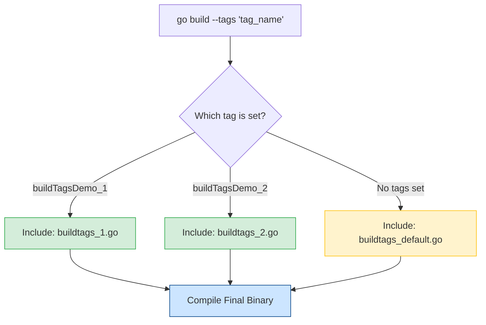

# Go Build Tags (Build Constraints) 🏷️

Build tags are a powerful feature in Go that allow you to conditionally include or exclude files from the compilation process. This is essential for cross-platform development, feature flagging, and separating different types of tests.

## How it Works

The Go compiler scans the top of each `.go` file for build constraints. These are special comments that must appear **at the very top of the file**, followed by a blank line before the `package` declaration.

### Syntax (Go 1.17+)

The modern syntax uses the `//go:build` directive with boolean logic:

| Operator | Description | Example |
| :--- | :--- | :--- |
| `&&` | AND | `//go:build linux && amd64` |
| `\|\|` | OR | `//go:build linux \|\| darwin` |
| `!` | NOT | `//go:build !windows` |
| `( )` | Grouping | `//go:build (linux \|\| darwin) && cgo` |

## Visual Compilation Process 🏗️

The following diagram illustrates how the compiler selects which file to include based on the tags provided during the build command.



---

## Hands-on Example

In this directory, we have a package called `buildTags` with three different implementations of the `WelcomeMessage()` function.

### 1. File Structure
- `buildtags_1.go` → contains `//go:build buildTagsDemo_1`
- `buildtags_2.go` → contains `//go:build buildTagsDemo_2`
- `buildtags_default.go` → contains `//go:build !buildTagsDemo_1 && !buildTagsDemo_2`

### 2. Running the Code

Try running the following commands from this directory to see how the output changes:

#### **Option A: Select Tag 1**
```bash
go run --tags buildTagsDemo_1 main.go
# Output: Hello, this is the 2022 Sept Go Training course! I am using build tag 1!
```

#### **Option B: Select Tag 2**
```bash
go run --tags buildTagsDemo_2 main.go
# Output: Hello, this is the 2022 Sept Go Training course! I am using build tag 2!
```

#### **Option C: Use Default (No tags)**
```bash
go run main.go
# Output: Hello, this is the Go Training course! No build tag selected.
```

---

## Common Use Cases 🛠️

### 🌐 Operating System Specifics
Go automatically handles files ending in `_windows.go`, `_linux.go`, etc. However, you can use tags for more complex scenarios:
```go
//go:build linux || darwin || freebsd
```

### 🧪 Integration Testing
Separate your long-running integration tests from fast unit tests.
```go
// File: database_integration_test.go
//go:build integration

func TestHeavyDatabase(t *testing.T) { ... }
```
Run them with: `go test -tags=integration ./...`

### 🚩 Feature Flags
Include experimental features in a build without affecting the stable production binary.
```go
//go:build experimental
```

## Critical Rules to Remember ⚠️
1. **Placement:** Must be at the very top of the file.
2. **Spacing:** Must have a blank line between the constraint and the `package` name.
3. **Legacy Syntax:** You might see `// +build` in older codebases. Go 1.17+ prefers `//go:build`, but the compiler still supports both for backwards compatibility.

[Customising Go Binaries with Build Tags](https://www.digitalocean.com/community/tutorials/customizing-go-binaries-with-build-tags)
