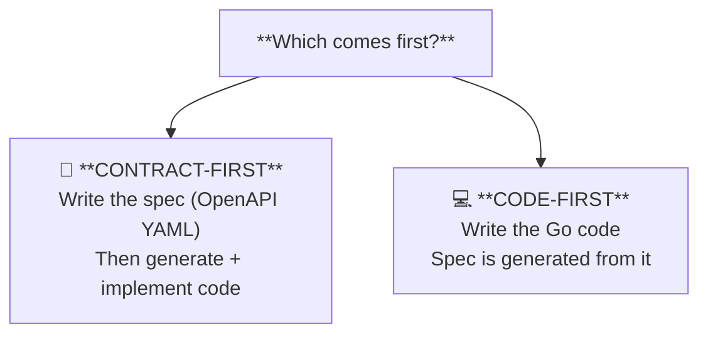
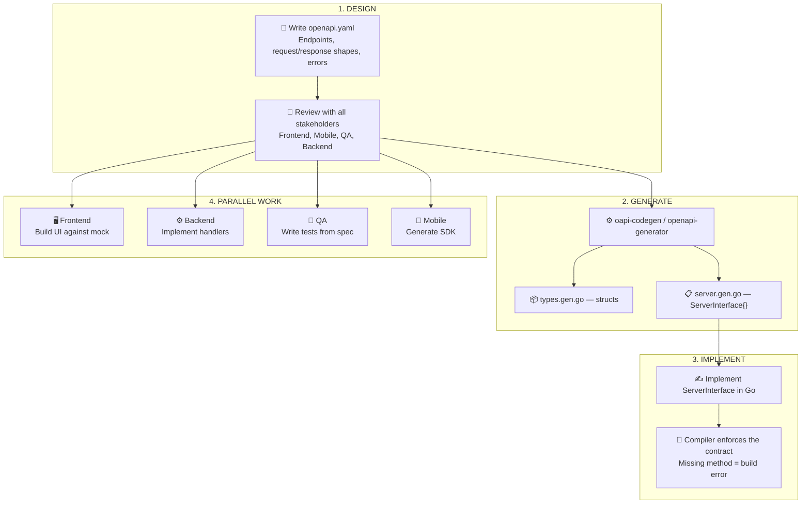
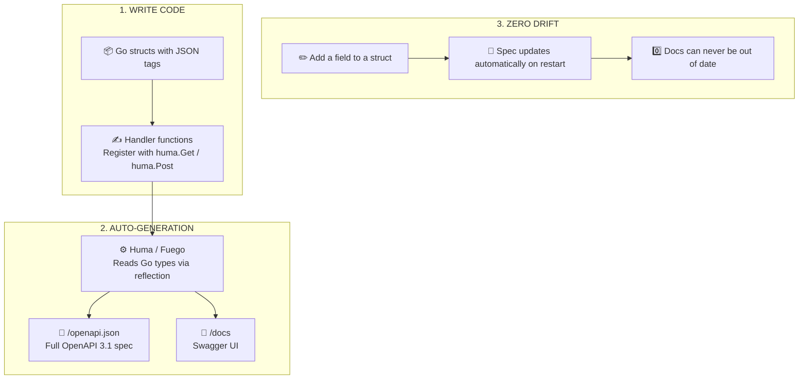
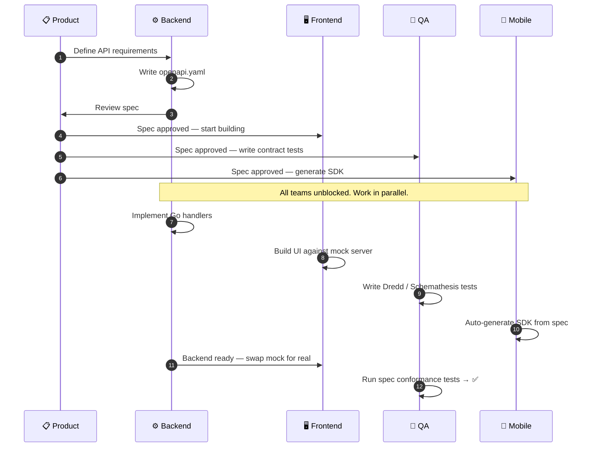
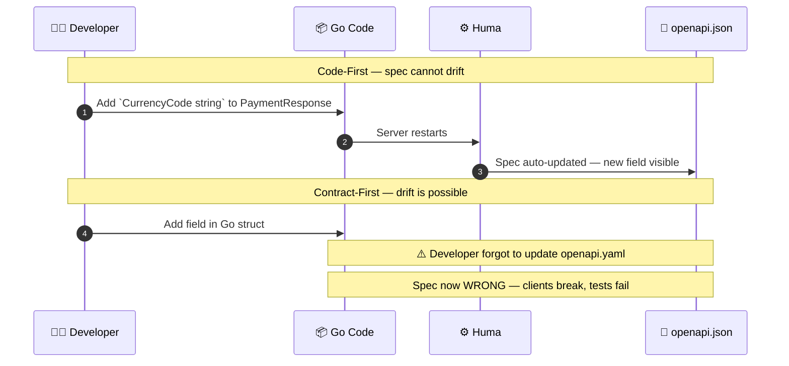
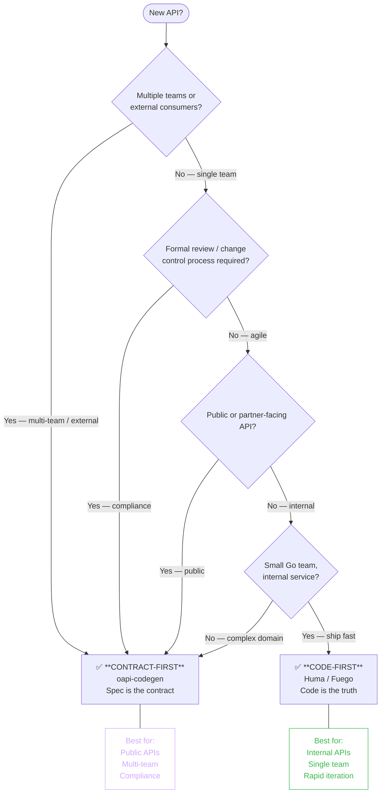
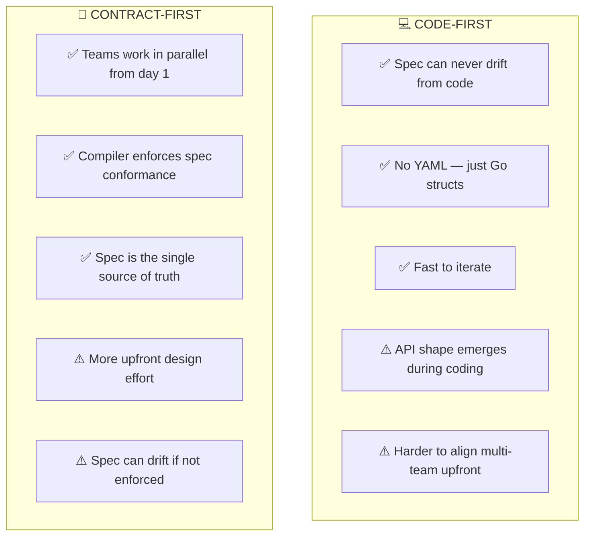

# Contract-First vs Code-First Design

---

## The Core Question

> Both approaches produce an OpenAPI spec and a working API. The difference is **which artifact drives the other**.

---

## Contract-First: Spec Before Code

> All teams work in parallel from the day the spec is agreed. No waiting for a working backend.

---

## Code-First: Code Before Spec

> The code IS the source of truth. The spec is always a live reflection of what's deployed.

---

## Parallel Development: Why Contract-First Enables It

---

## Spec Drift: The Code-First Advantage

> Code-first makes drift structurally impossible. Contract-first requires discipline (and tooling like Dredd) to detect it.

---

## Decision Guide

---

## Trade-offs at a Glance

> Example: public-facing APIs use contract-first — external consumers need a stable, reviewed spec. Internal services may use code-first for speed.
