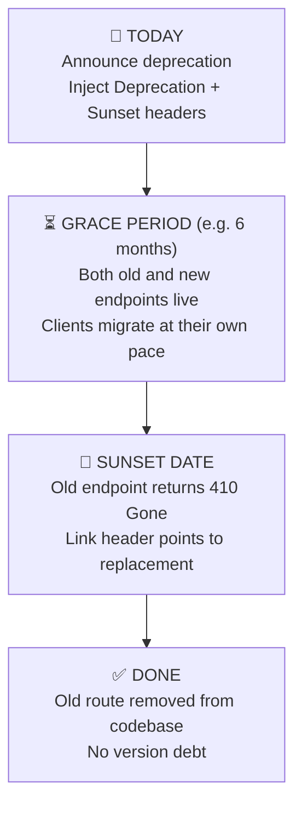
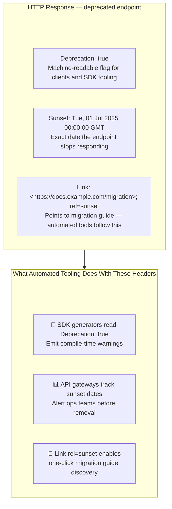
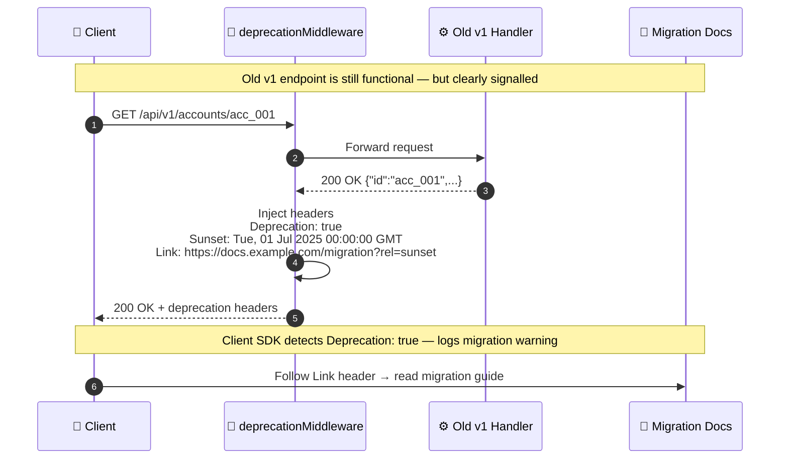
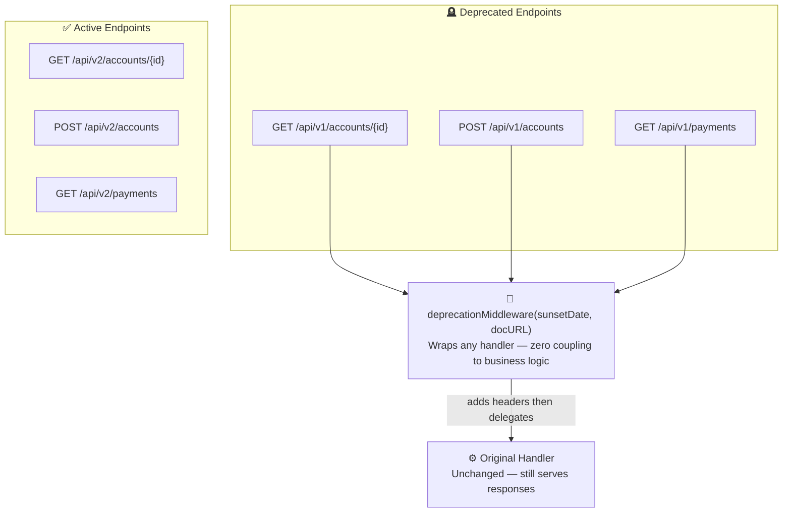
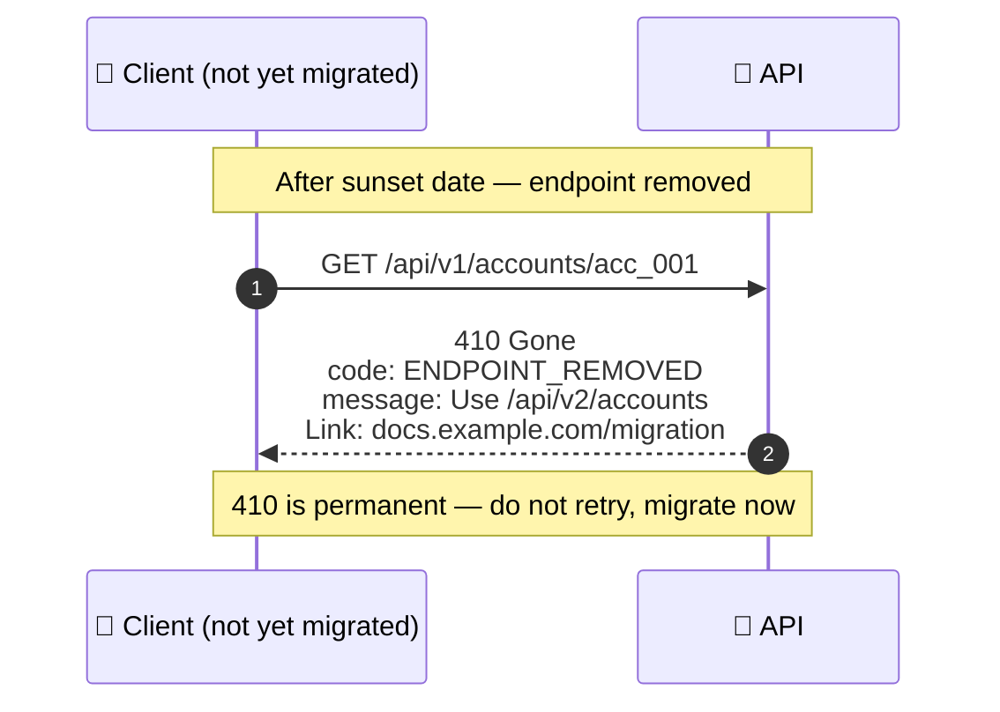
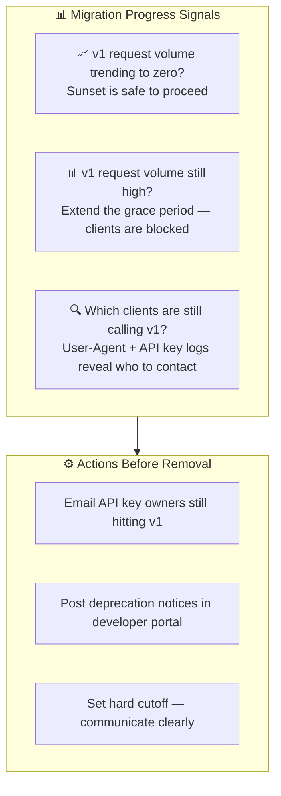

# Graceful Sunsetting

---

## Deprecation Is a Process, Not an Event

> Clients — and their automated tooling — need explicit signals. Headers are that signal.

---

## Standard Deprecation Headers

---

## Deprecation Middleware Flow

---

## Middleware as a Reusable Decorator

> The middleware is a thin decorator. The handler is unaware it is being deprecated. Separation of concerns.

---

## After Sunset: 410 Gone

> `410 Gone` is the correct status after sunset. `404 Not Found` implies it might come back. `410` is permanent.

---

## Tracking Who Is Still on v1

> Never remove a version without first checking traffic. Logs tell you when it is safe. Until then, keep the grace period open.
