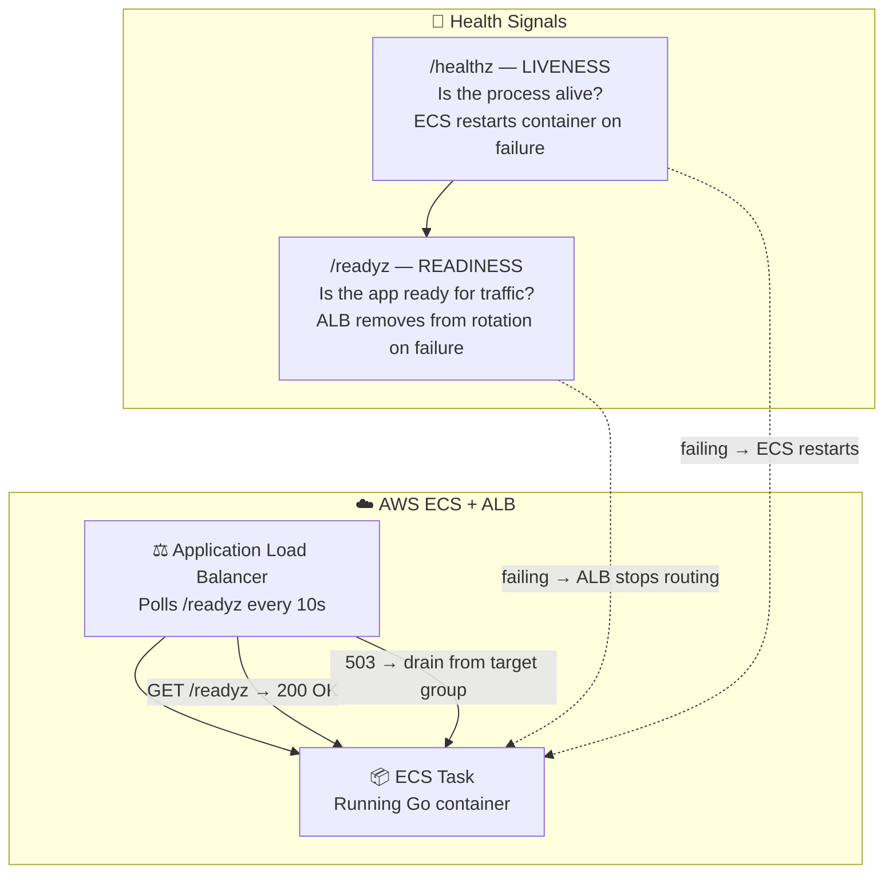
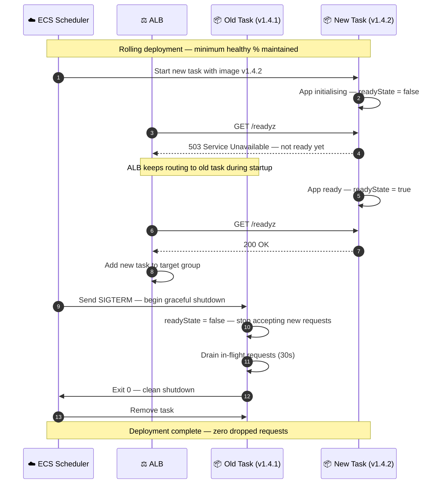
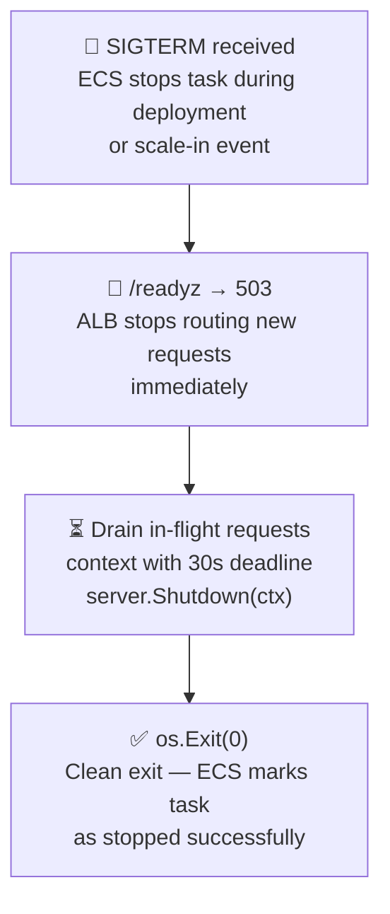
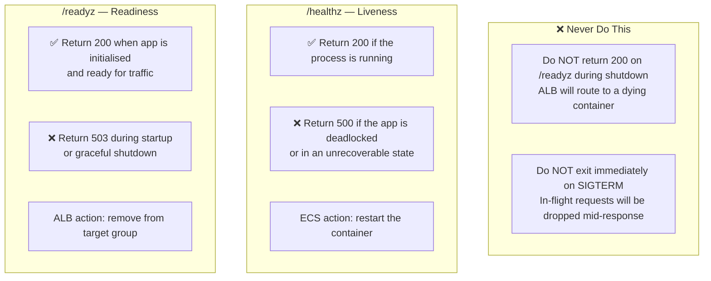
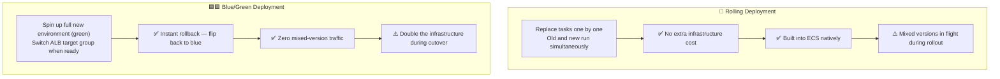
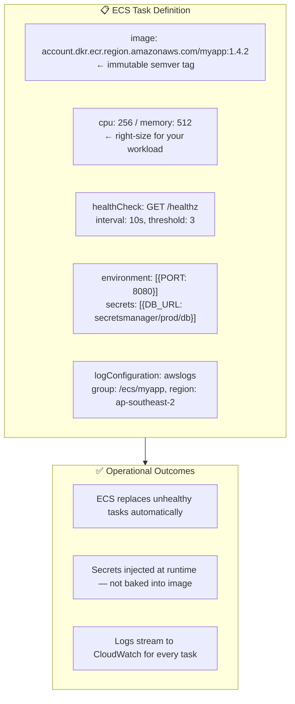

# Cloud Deployment

---

## ECS Needs Explicit Signals to Manage Traffic

> Liveness tells ECS to restart. Readiness tells the ALB to stop sending traffic. They serve different purposes.

---

## Rolling Deployment with Health Checks

---

## Graceful Shutdown: SIGTERM to Exit 0

> `server.Shutdown(ctx)` stops accepting new connections but waits for active requests to complete before returning.

---

## Liveness vs Readiness: What Each Check Does

> Set readyState to false on SIGTERM immediately — before draining. This stops ALB routing before the drain begins.

---

## Blue/Green vs Rolling: Choosing a Strategy

> Rolling suits stateless APIs with backwards-compatible changes. Blue/Green suits high-risk releases where instant rollback matters.

---

## ECS Task Definition: Key Fields

> Never bake secrets into the image. Inject them at runtime via AWS Secrets Manager. The image is immutable and shareable — secrets are not.
