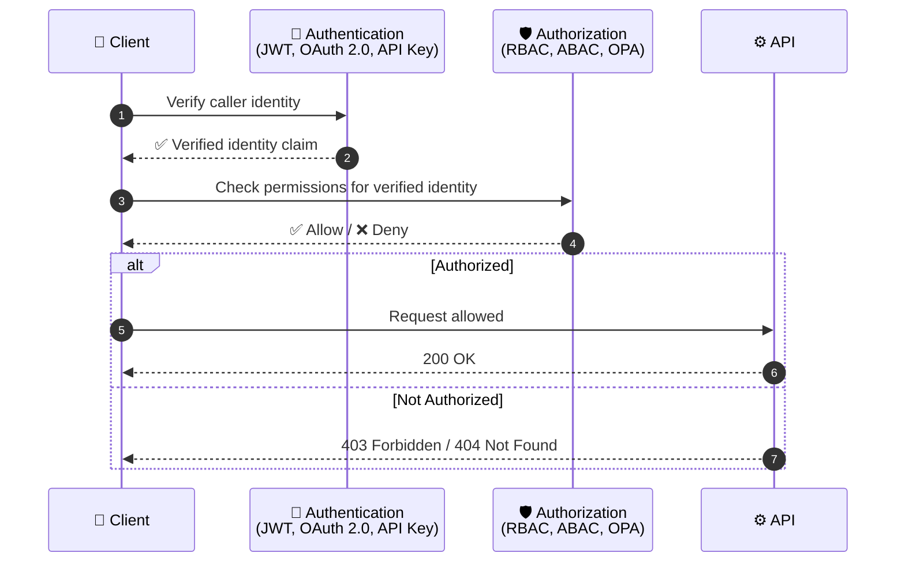
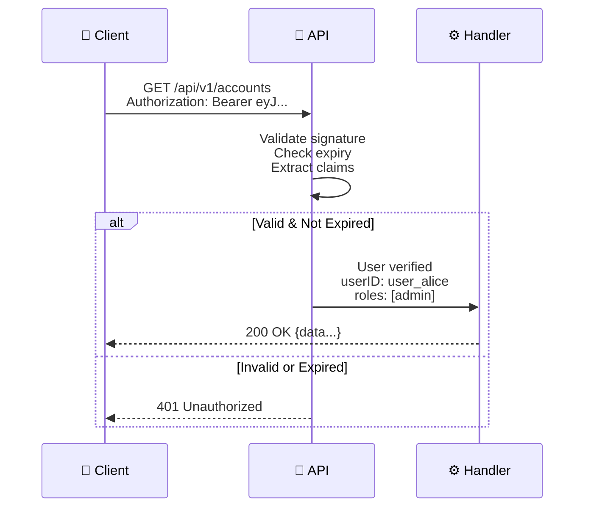
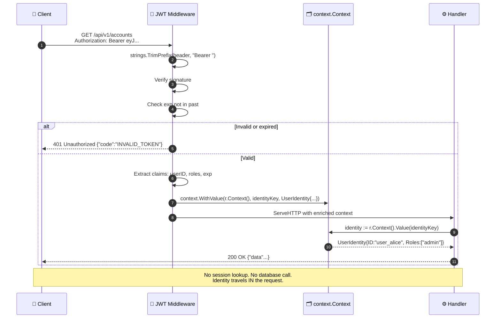
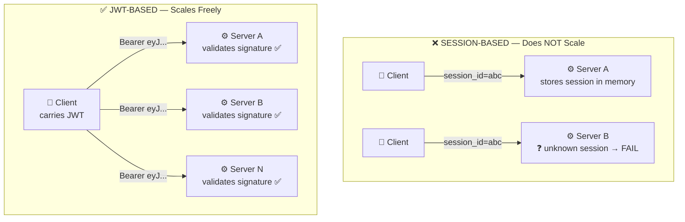
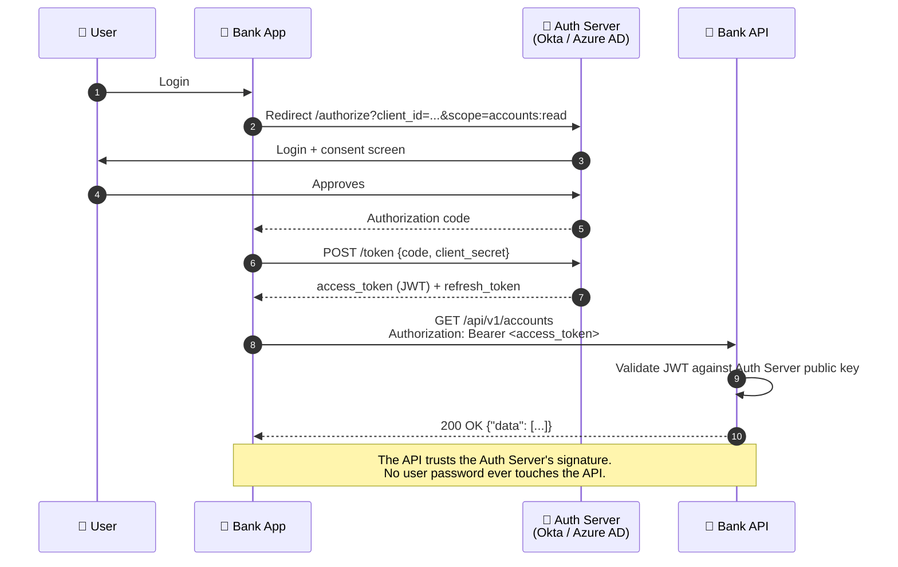
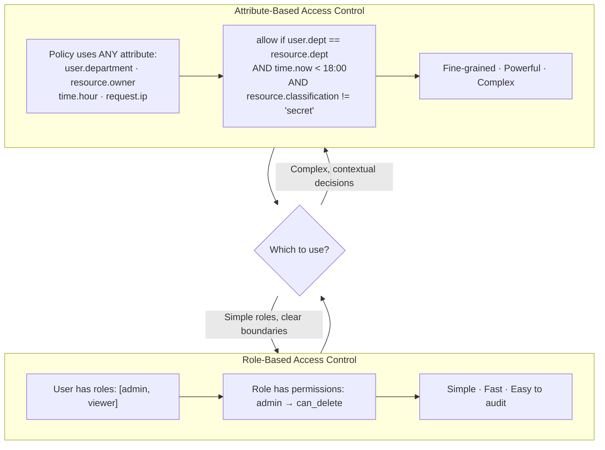
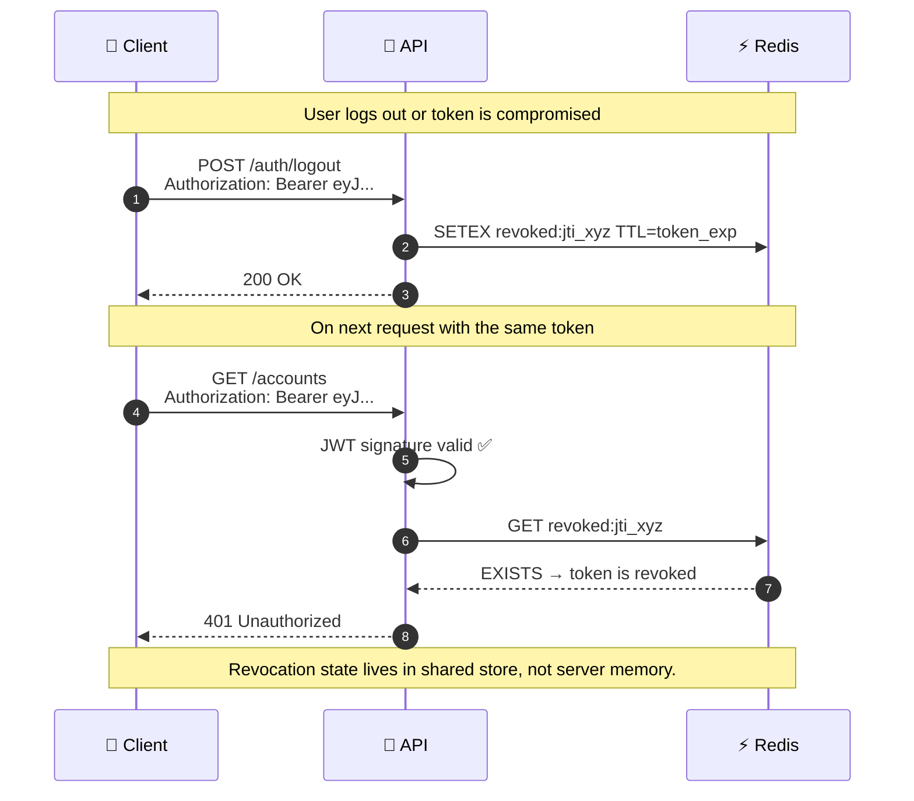
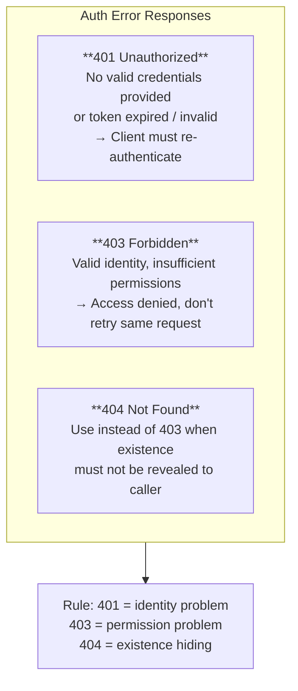

# AuthN / AuthZ

---

## Authentication vs Authorisation



> Authentication must succeed **before** authorisation can be evaluated. You cannot check permissions for an unknown caller.

---

## JWT: A Self-Contained Identity Token

**JWT Structure: `header.payload.signature`**

| Component | Purpose | Example |
|-----------|---------|---------|
| **📋 HEADER** | Algorithm & token type | <code>{<br/>&nbsp;&nbsp;"alg":&nbsp;&nbsp;"HS256",<br/>&nbsp;&nbsp;"typ": "JWT"<br/>}</code> |
| **📦 PAYLOAD** | Identity claims | <code>{<br/>&nbsp;&nbsp;"sub": "user_alice",<br/>&nbsp;&nbsp;"roles": ["admin"],<br/>&nbsp;&nbsp;"exp": 1735689600<br/>}</code> |
| **🔐 SIGNATURE** | Proof of authenticity | `HMAC-SHA256(header.payload, secret_key)` |

**Encoded:** `eyJhbGc...Ew.eyJzdWI...NX0.SflKxw...`




> The signature guarantees the payload was **not tampered with**. The expiry prevents stolen tokens from being valid forever.

---

## JWT Validation Flow



---

## Stateless: Why JWT Scales



---

## Go Typed Context Keys — No String Collisions

### ❌ BAD — String Keys (Collisions & Accidental Overwrites)

```go
// Package: auth
ctx = context.WithValue(ctx, "userID", "user_123")

// Package: logging (different developer)
ctx = context.WithValue(ctx, "userID", "log_456")  // OOPS! Overwrite!

// Package: auth tries to read
userID := ctx.Value("userID")  // Gets "log_456", not "user_123" ❌
```

**Problems:**
- Any package can use the string key `"userID"`
- Name collisions are invisible — one package silently overwrites another
- Type assertion to `interface{}` requires runtime conversion with risk of panics
- No compiler protection — mistakes discovered only at runtime

---

### ✅ GOOD — Private Typed Keys (No Collisions Possible)

```go
// Package: auth (internal package)
package auth

type contextKey struct{}
var identityKey = contextKey{}  // Unexported — only this package can use it

// Set identity in context
func WithIdentity(ctx context.Context, identity UserIdentity) context.Context {
    return context.WithValue(ctx, identityKey, identity)
}

// Get identity from context
func IdentityFromContext(ctx context.Context) (UserIdentity, bool) {
    identity, ok := ctx.Value(identityKey).(UserIdentity)
    return identity, ok
}
```

**Advantages:**
- The type `contextKey` is **private** (unexported) — only this package can instantiate it
- No other package can accidentally use the same key — impossible to collide
- Type safety — Go's compiler prevents type mismatches
- Clear API — consumers call `IdentityFromContext()` instead of guessing string keys

> A private unexported type as the context key is **impossible to collide with** — only that package can set or read it.

---

## OAuth 2.0: Delegated Access



---

## RBAC vs ABAC



---

## Token Revocation: The Stateless Edge Case



> The server remains stateless per-instance. Revocation state lives in the **shared store**, not in server memory.

---

## HTTP Status Codes for Auth Failures



> Return `404` instead of `403` when revealing that a resource *exists* would itself be a security leak.
