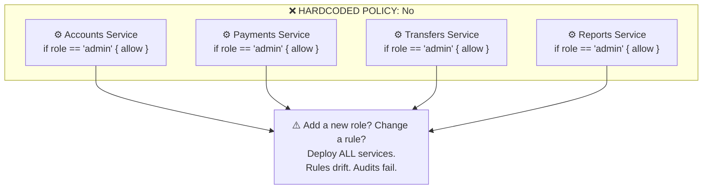
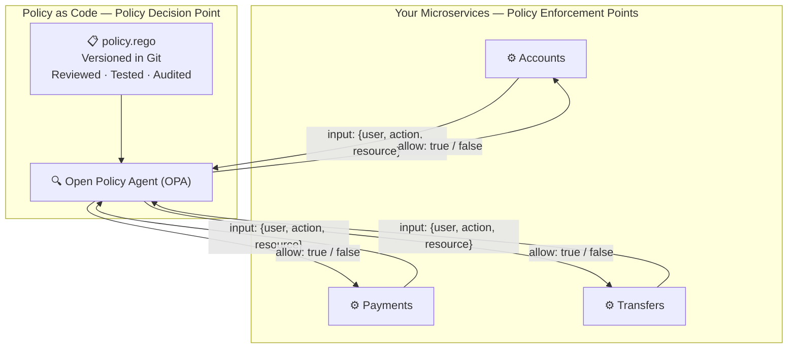
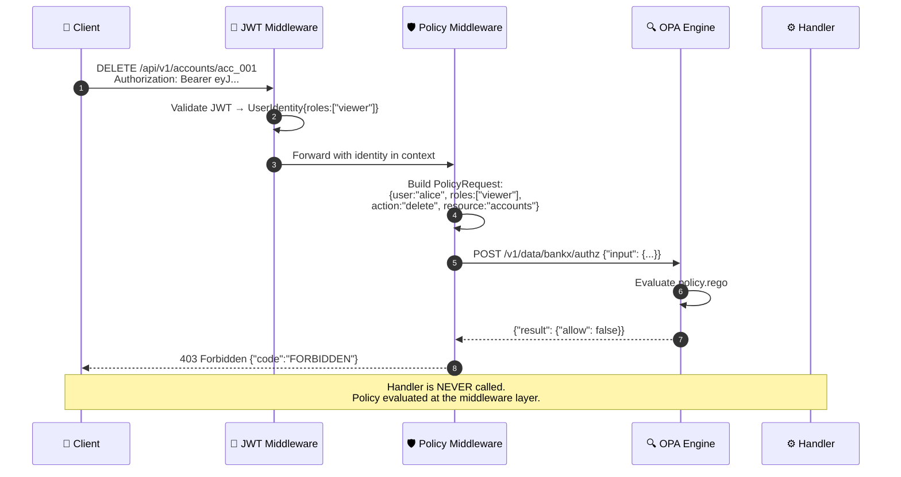
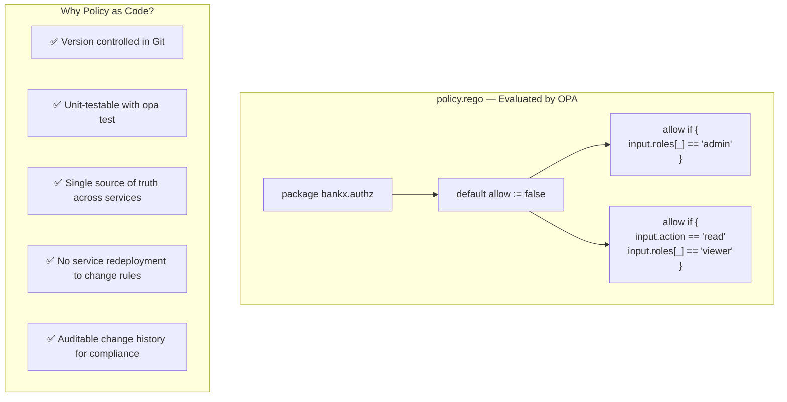
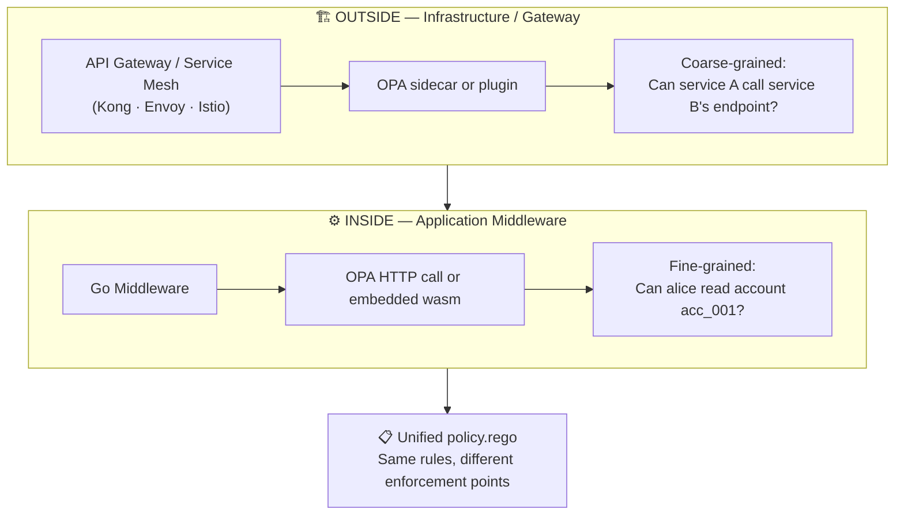
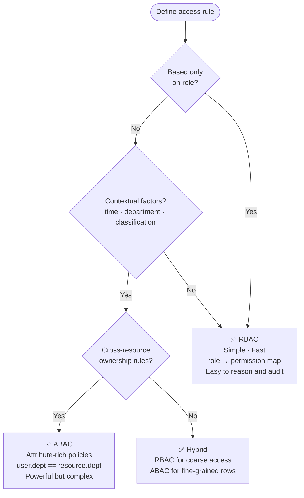
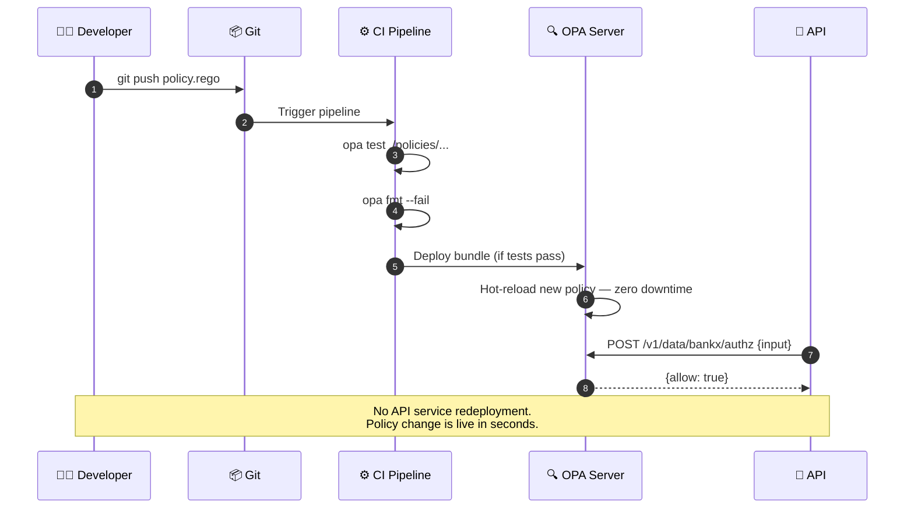
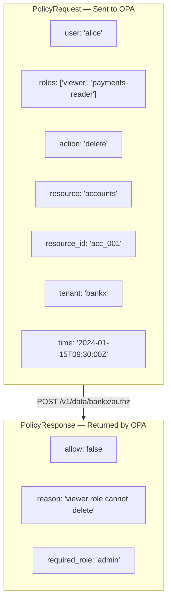

# Policy as Code

---

## The Problem: Hardcoded Rules Everywhere

---

## Decouple Decision from Enforcement

> Services **enforce** policy (PEP). OPA **decides** policy (PDP). Rules live in one place, versioned, auditable.

---

## Authorisation Middleware Flow

---

## OPA Rego Policy

---

## Enforcement: Inside vs Outside the Application

> Both enforcement points share **the same policy files**. Consistency across the entire stack.

---

## RBAC vs ABAC — When to Use Each

---

## Policy Lifecycle: From Commit to Decision

> Policy changes ship independently. No service restarts. No coordination with 10 teams.

---

## What Goes in a Policy Request

> Include enough context for the policy to make a meaningful decision. Sparse inputs produce blunt policies.
