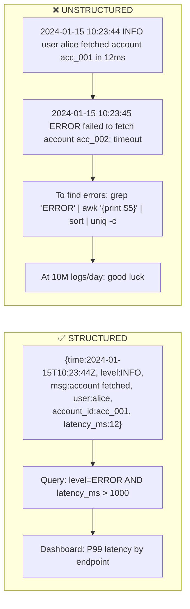
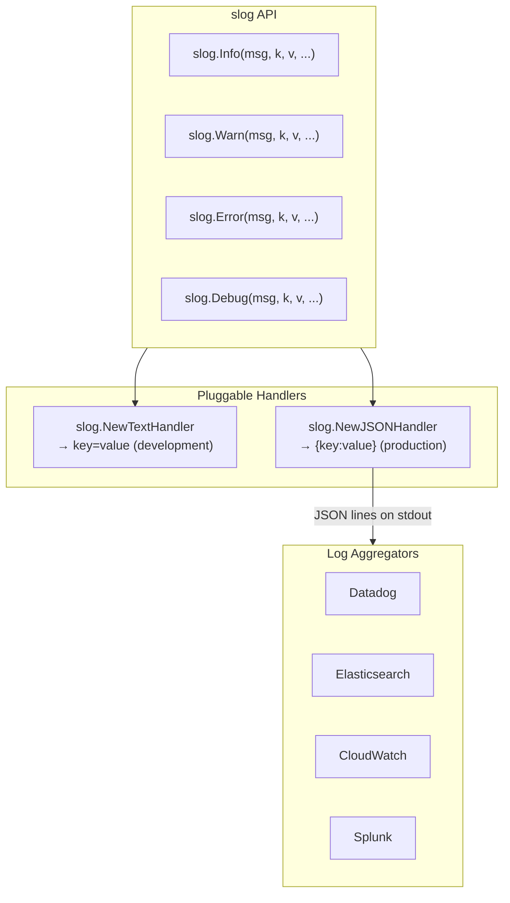
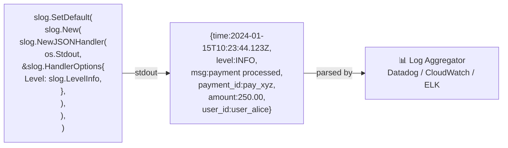
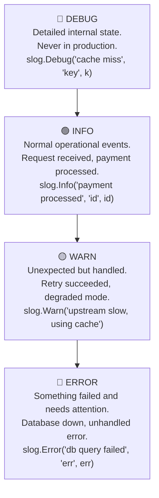
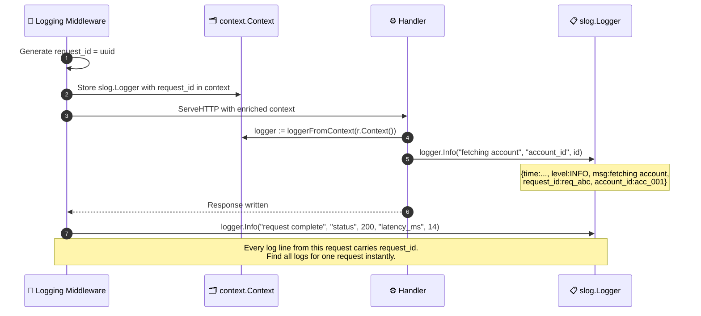
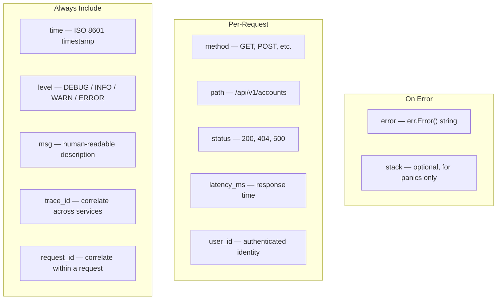
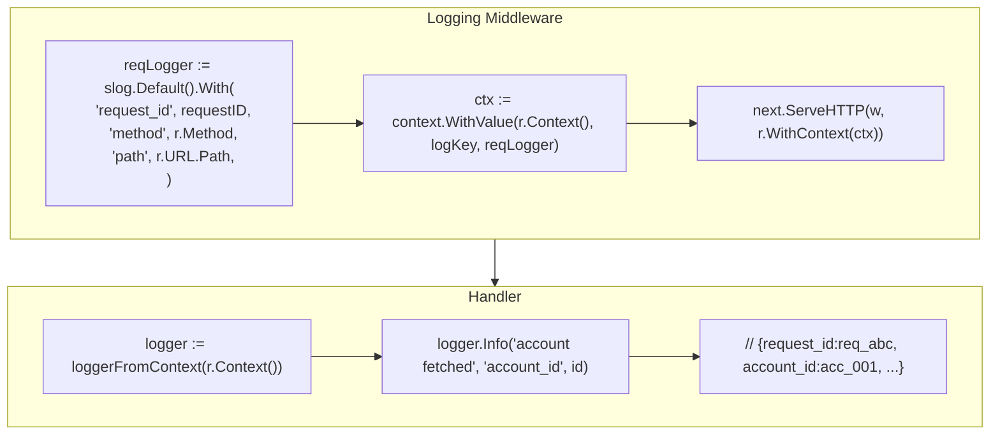
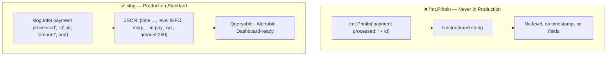

# Structured Logging with slog

---

## Unstructured vs Structured Logs

> Unstructured: ❌ Impossible to Query at Scale   Structured: ✅ Machine-Readable, Instantly Queryable

---

## log/slog: Go's Native Structured Logger

> Switch from text to JSON with **one line** at startup. Zero changes to log call sites.

---

## JSON Handler: Production Configuration

---

## Log Levels: When to Use Each

---

## Logger with Context: Propagating Fields

---

## Structured Log Fields: What to Always Include

---

## Logger-Per-Request Pattern

> Every `With(...)` call returns a **new** logger — the original is unchanged. Fields accumulate down the call chain.

---

## slog vs fmt.Println

> `log/slog` is in the Go standard library since **1.21**. No external dependencies needed.
