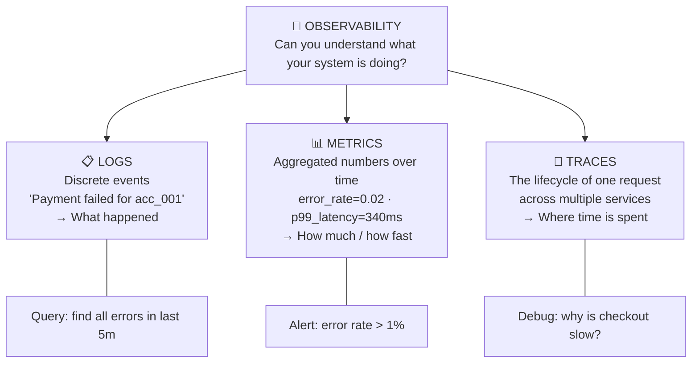
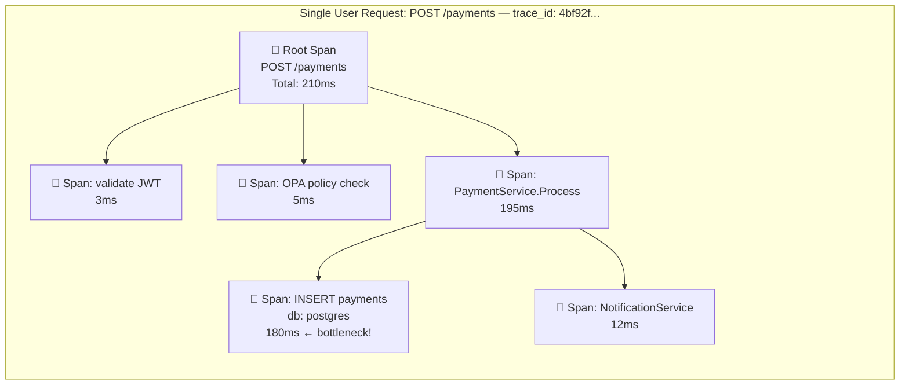
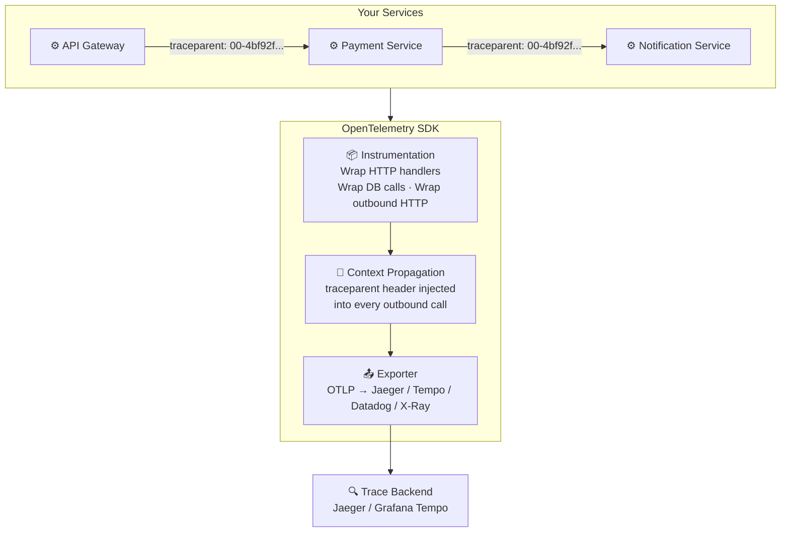
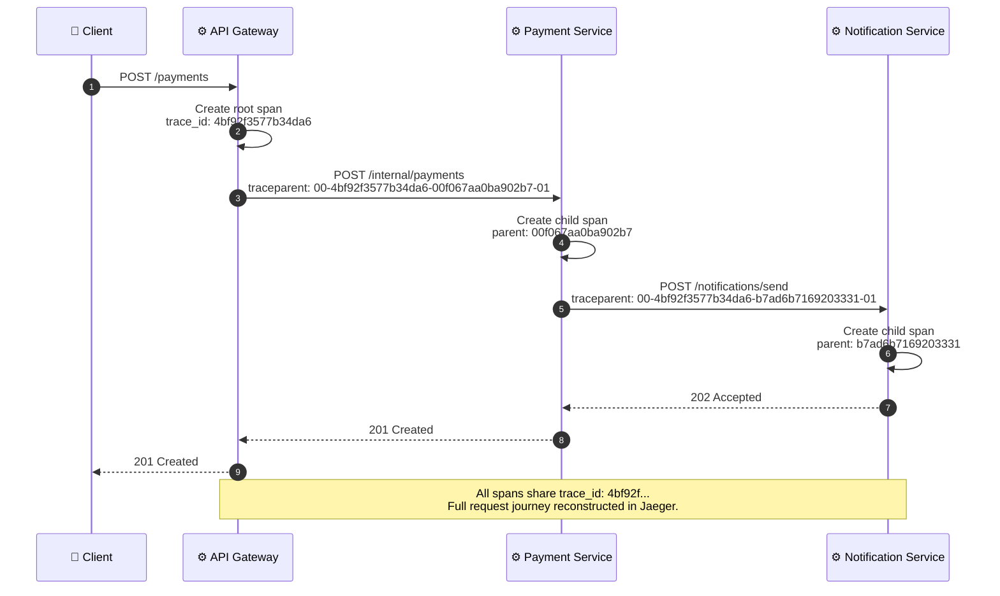
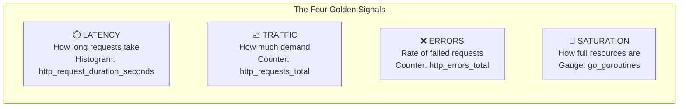
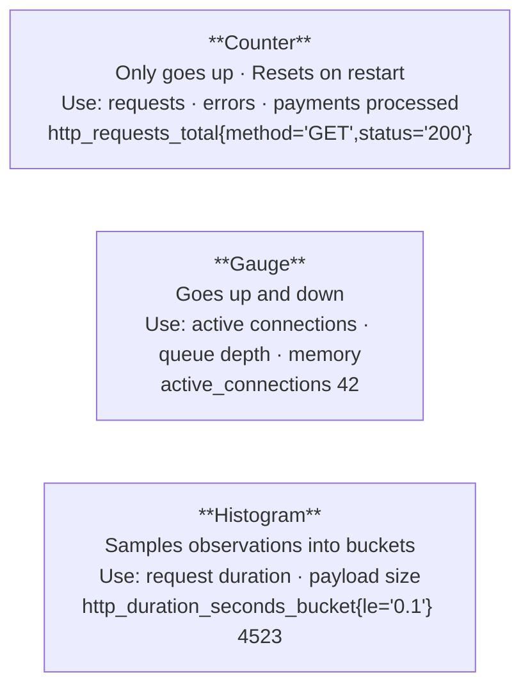
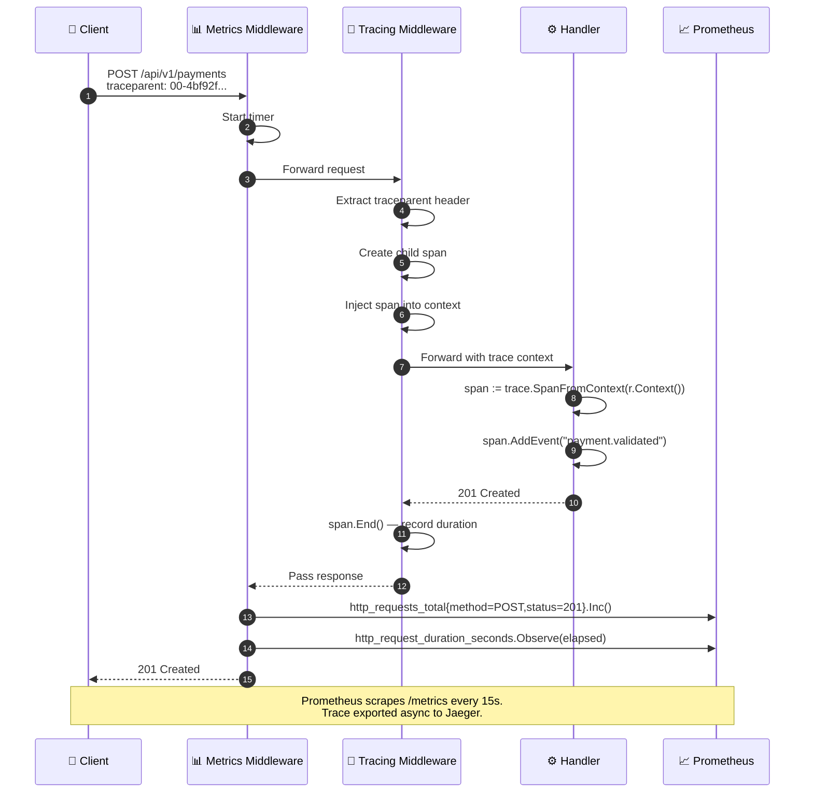
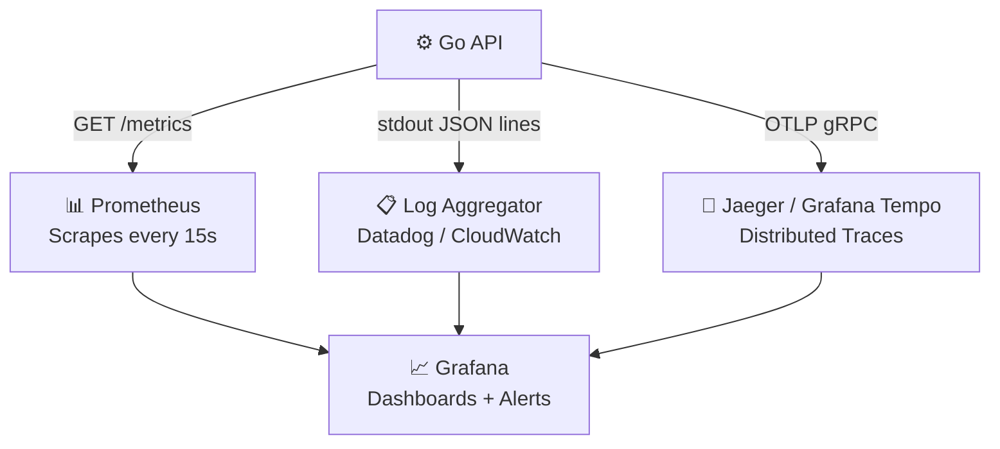
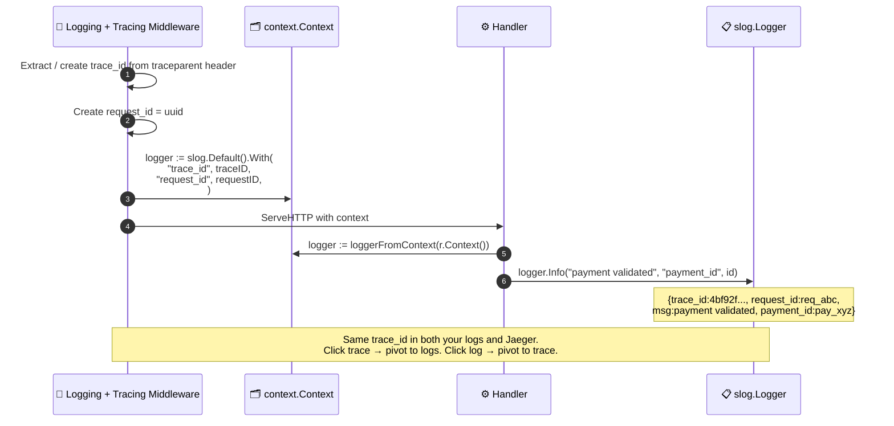

# Distributed Tracing

---

## The Three Pillars of Observability

> Logs tell you **what**. Metrics tell you **how much**. Traces tell you **where**.

---

## Anatomy of a Distributed Trace

> Without tracing, you see a 210ms P99. With tracing, you see the DB insert is 180ms. **Now you know what to fix.**

---

## OpenTelemetry: The Standard

> One `trace_id` ties together spans from every service in the call chain.

---

## Trace Propagation Across Services

---

## Prometheus: The Four Golden Signals

---

## Prometheus Metric Types

---

## Metrics + Tracing Middleware Flow

---

## The Full Observability Stack

> One Grafana dashboard — logs, metrics, and traces linked by `trace_id`. Full system visibility.

---

## Correlating Logs and Traces

> Inject `trace_id` into every log line. Logs and traces become **navigable together** in Grafana.
