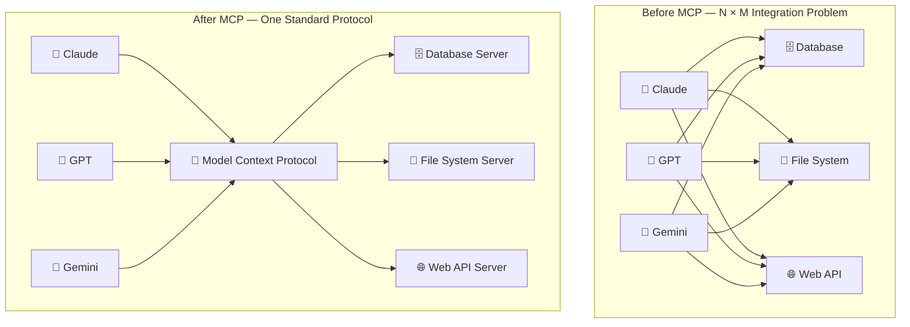
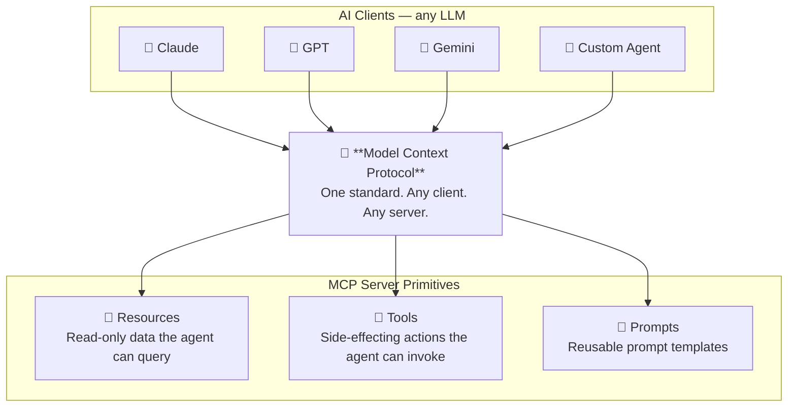
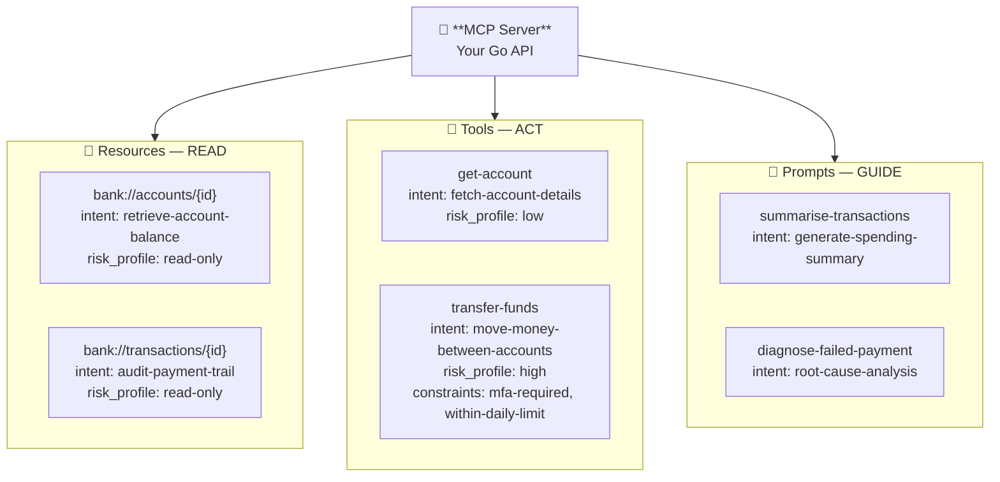
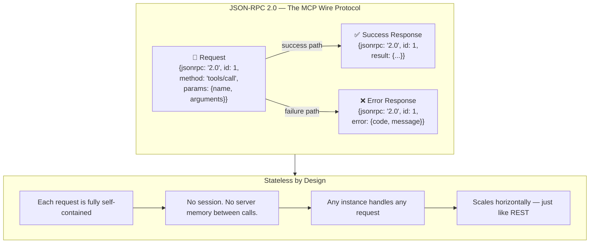
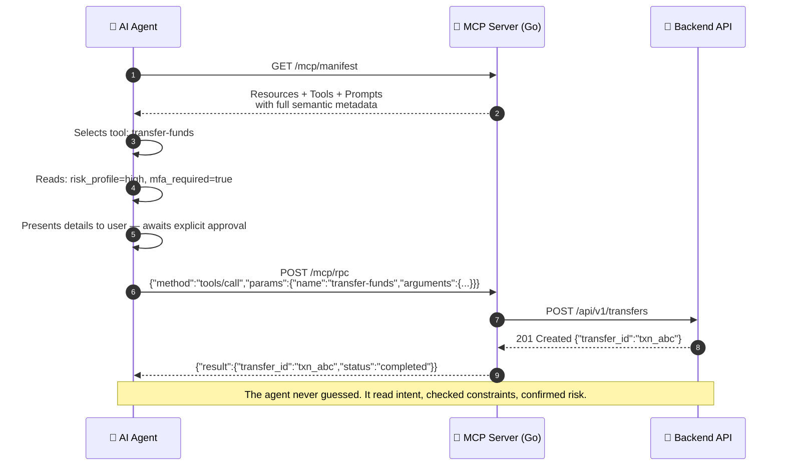
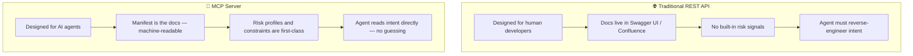

# Model Context Protocol (MCP)

---

## The Problem MCP Solves

> Just as USB-C standardises how devices connect to peripherals, **MCP standardises how AI agents connect to application context** — regardless of the underlying LLM or backend.

---

## MCP: The USB-C Port for AI

---

## MCP Primitives in Detail

```mermaid
graph TB
    subgraph Resources["📄 Resources — READ ONLY"]
        R1["URI-addressed data"]
        R2["bank://accounts/{id}"]
        R3["risk_profile: read-only<br/>No side effects — safe to call freely"]
        R1 --> R2 --> R3
    end

    subgraph Tools["🔧 Tools — ACT"]
        T1["Named functions with typed parameters"]
        T2["transfer-funds, get-account, cancel-payment"]
        T3["risk_profile: low / medium / high<br/>May have irreversible side effects"]
        T1 --> T2 --> T3
    end

    subgraph Prompts["💬 Prompts — GUIDE"]
        P1["Parameterised prompt templates"]
        P2["summarise-transactions, diagnose-failed-payment"]
        P3["Reusable reasoning patterns<br/>Consistent agent behaviour across calls"]
        P1 --> P2 --> P3
    end
```

---

## Anatomy of an MCP Server

---

## MCP Wire Protocol: JSON-RPC 2.0

> MCP tool calls are **stateless** — each JSON-RPC request carries all the context it needs. A natural fit for Go's concurrent, stateless HTTP server model.

---

## MCP Request Lifecycle

---

## MCP vs Traditional REST: What Changes

> MCP does not replace REST. It **wraps** your existing REST API with a machine-readable capability layer that agents can safely discover and invoke.
