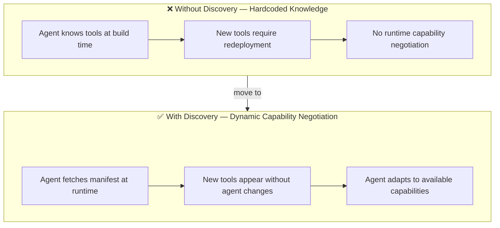
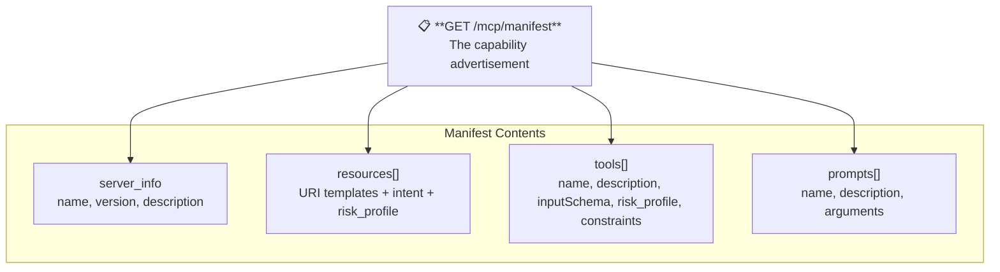
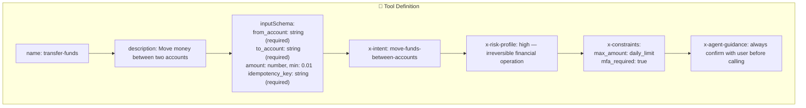
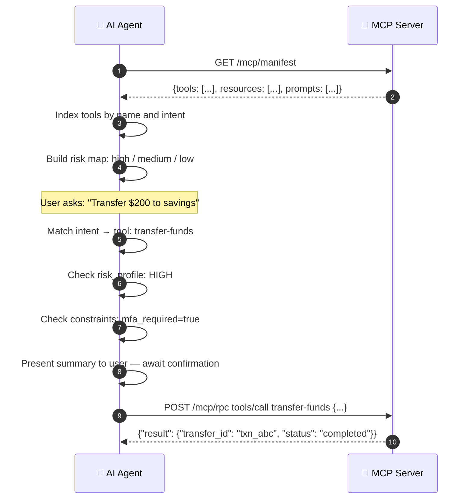
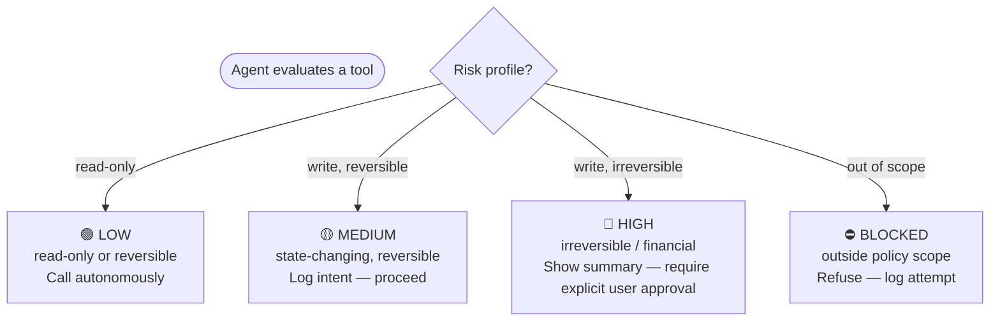
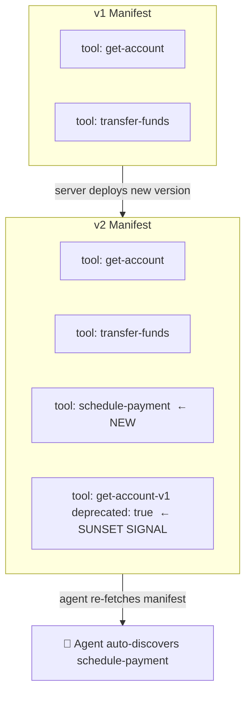
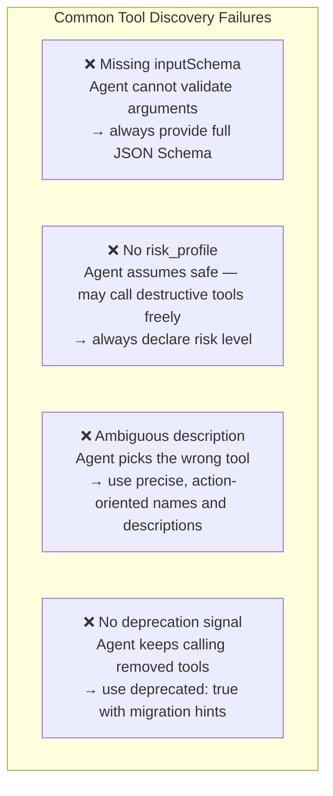
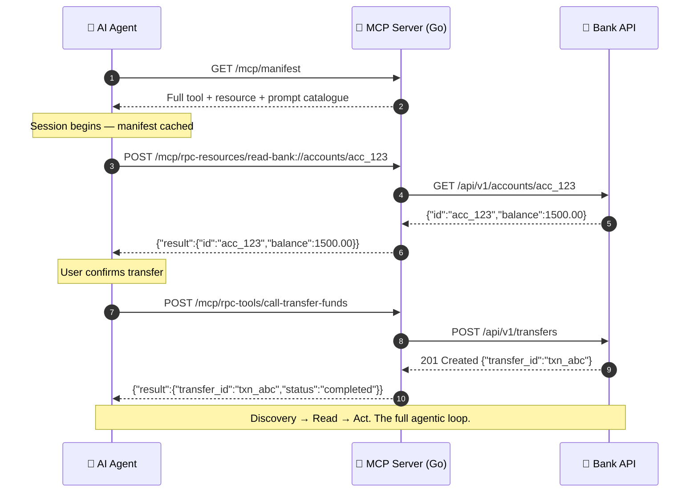

# Tool Discovery

---

## What Is Tool Discovery?

> Tool discovery lets agents **ask** what a server can do, rather than having that knowledge baked in at build time. Servers evolve; agents adapt automatically.

---

## The Manifest: A Server's Capability Advertisement

---

## Tool Schema: The Contract an Agent Reads

> The schema is not just validation — it is the **complete contract** the agent uses to decide whether and how to call the tool.

---

## Agent Discovery Flow

---

## Trust Levels: Not All Tools Are Equal

> The agent does not decide trust on its own — it reads the risk signal the server declared and acts accordingly.

---

## Versioned Manifests: Tools Evolve Safely

> Manifests should be versioned. Agents that re-fetch the manifest on each session automatically gain new capabilities and respect deprecation signals — no redeployment needed.

---

## Discovery Failure Modes

---

## Full Discovery + Execution Flow

